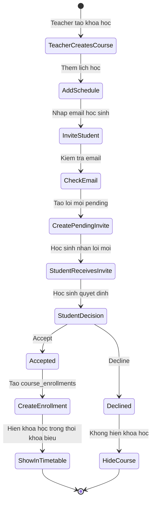
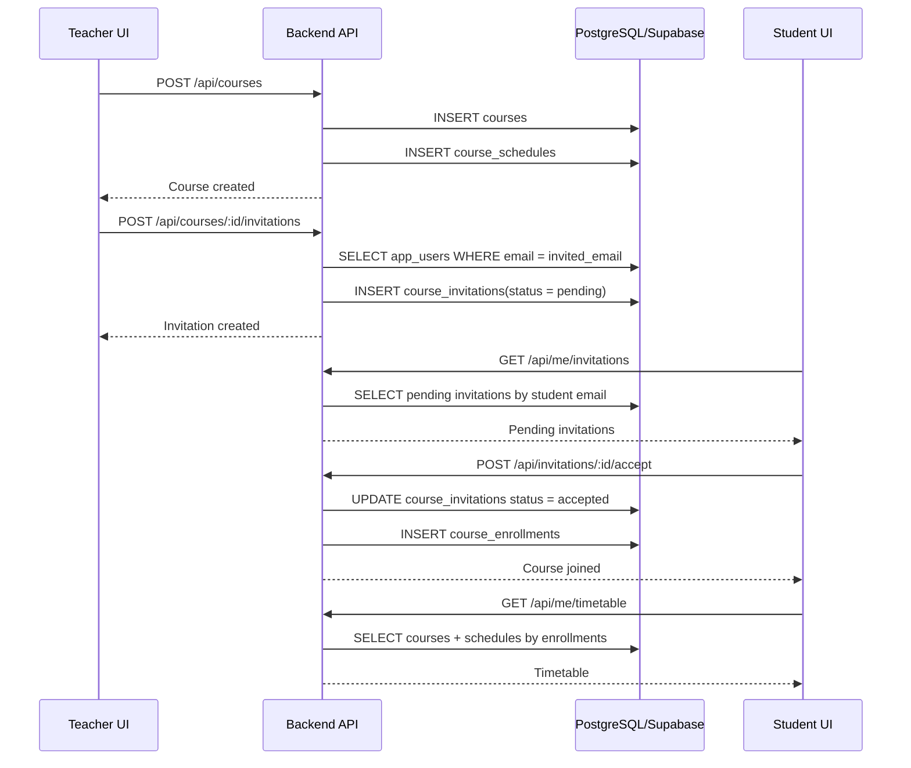
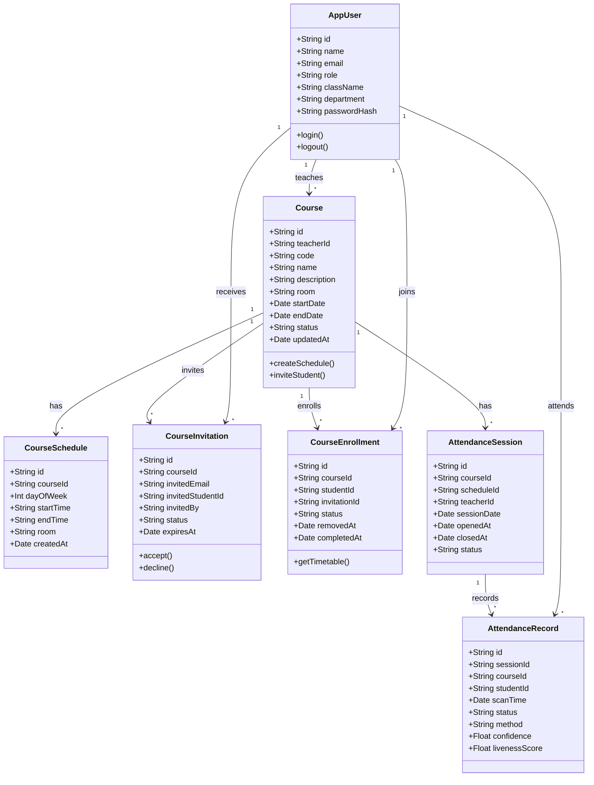
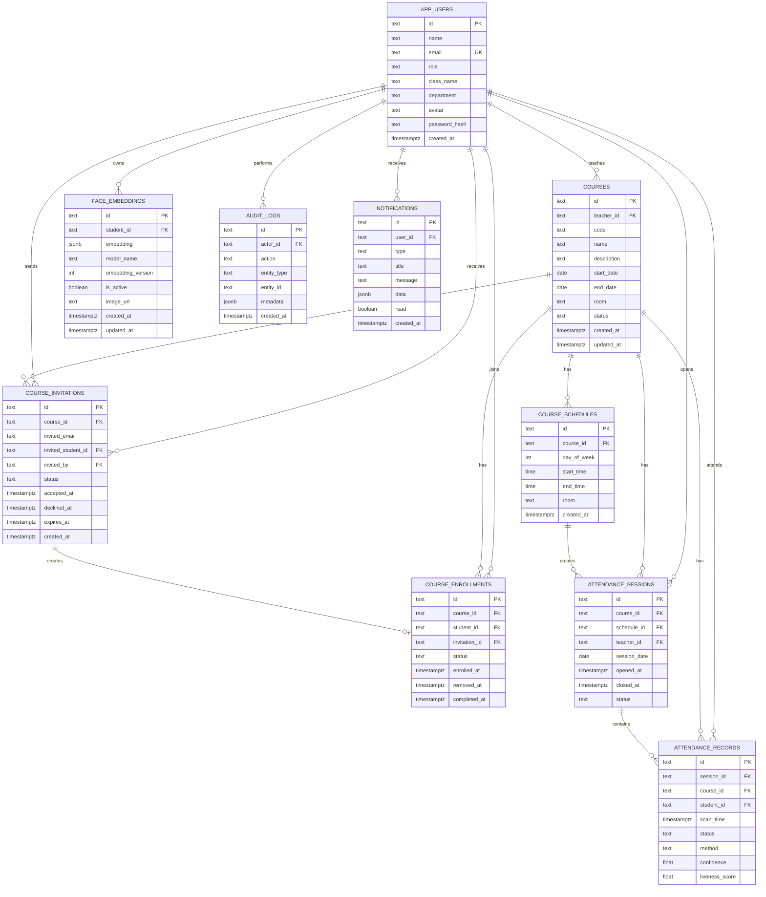
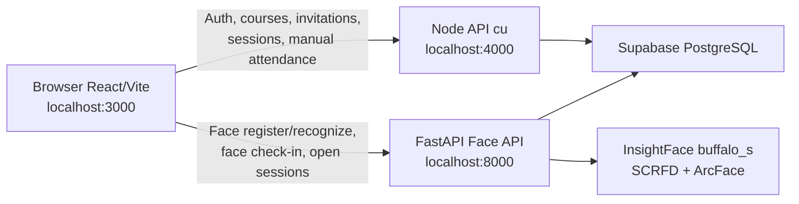

# Tai lieu Phan tich va Thiet ke He thong SmartAttend (FACEID)

Tai lieu nay mo ta workflow moi cua SmartAttend: giao vien tao khoa hoc, moi hoc sinh bang email, hoc sinh chap nhan loi moi, lop hoc tu dong xuat hien trong thoi khoa bieu, sau do giao vien mo phien diem danh bang nhan dien khuon mat.

---

## 1. Muc tieu he thong

SmartAttend la he thong quan ly lop hoc va diem danh bang nhan dien khuon mat. He thong tap trung vao ba vai tro:

| Vai tro | Mo ta |
| --- | --- |
| `admin` | Quan tri he thong, theo doi nguoi dung va cau hinh chung. |
| `teacher` | Tao khoa hoc, moi hoc sinh, quan ly lich hoc va mo phien diem danh. |
| `student` | Dang ky tai khoan, chap nhan loi moi vao khoa hoc, xem thoi khoa bieu va diem danh. |

---

## 2. Workflow nghiep vu moi

### 2.1 Giao vien tao khoa hoc

1. Giao vien dang nhap vao he thong.
2. Giao vien vao man hinh `Classes` hoac `Courses`.
3. Giao vien tao khoa hoc moi voi cac thong tin:
   - Ten khoa hoc.
   - Ma khoa hoc.
   - Mo ta ngan.
   - Phong hoc.
   - Ngay bat dau.
   - Ngay ket thuc.
   - Trang thai khoa hoc: `draft`, `active`, `archived`.
   - Lich hoc hang tuan, vi du Thu 2 tiet 1-3, Thu 4 tiet 4-6.
4. Backend tao ban ghi trong bang `courses`.
5. Backend tao cac khung lich hoc trong bang `course_schedules`.

### 2.2 Giao vien moi hoc sinh bang email

1. Giao vien nhap email hoc sinh can moi.
2. He thong kiem tra email:
   - Neu email da ton tai trong `app_users` voi role `student`, tao loi moi gan voi hoc sinh do.
   - Neu email chua co tai khoan, van tao loi moi theo email de hoc sinh dang ky sau.
3. He thong tao ban ghi trong `course_invitations` voi trang thai `pending`.
4. Hoc sinh nhan loi moi trong app hoac qua email.

### 2.3 Hoc sinh chap nhan loi moi

1. Hoc sinh dang nhap hoac dang ky bang dung email duoc moi.
2. Hoc sinh xem danh sach loi moi dang cho.
3. Hoc sinh chon:
   - `accept`: Dong y tham gia khoa hoc.
   - `decline`: Tu choi loi moi.
4. Neu hoc sinh chap nhan:
   - Cap nhat `course_invitations.status = 'accepted'`.
   - Tao ban ghi trong `course_enrollments`.
   - Khoa hoc va lich hoc tu dong hien trong thoi khoa bieu cua hoc sinh.
5. Neu hoc sinh tu choi:
   - Cap nhat `course_invitations.status = 'declined'`.
   - Khong tao enrollment.

### 2.4 Hoc sinh xem thoi khoa bieu

1. Hoc sinh mo man hinh `StudentDashboard` hoac `Schedule`.
2. Backend lay danh sach khoa hoc ma hoc sinh da chap nhan trong `course_enrollments`.
3. Backend join voi `course_schedules` de tra ve lich hoc theo ngay trong tuan.
4. Frontend hien thi cac lop da duoc xac nhan trong thoi khoa bieu.

### 2.5 Giao vien diem danh

1. Giao vien chon khoa hoc dang day.
2. Giao vien mo phien diem danh cho mot buoi hoc.
3. He thong tao `attendance_sessions`.
4. Camera quet khuon mat hoc sinh.
5. AI service xac minh khuon mat va liveness.
6. Backend chi ghi nhan diem danh neu hoc sinh da co enrollment trong khoa hoc.
7. Ket qua duoc luu vao `attendance_records`.

---

## 3. Use Case Diagram

```mermaid
usecaseDiagram
    actor Admin as "Admin"
    actor Teacher as "Teacher"
    actor Student as "Student"

    package "SmartAttend" {
        usecase "Dang nhap / Dang xuat" as UC_AUTH
        usecase "Dang ky tai khoan" as UC_REGISTER
        usecase "Tao khoa hoc" as UC_CREATE_COURSE
        usecase "Cap nhat lich hoc" as UC_SCHEDULE
        usecase "Moi hoc sinh bang email" as UC_INVITE
        usecase "Quan ly danh sach hoc sinh" as UC_ENROLLMENT
        usecase "Chap nhan / Tu choi loi moi" as UC_ACCEPT
        usecase "Xem thoi khoa bieu" as UC_TIMETABLE
        usecase "Mo phien diem danh" as UC_ATT_SESSION
        usecase "Diem danh bang khuon mat" as UC_FACE_ATT
        usecase "Xem bao cao diem danh" as UC_REPORT
        usecase "Quan tri nguoi dung" as UC_ADMIN_USERS
    }

    Admin --> UC_AUTH
    Admin --> UC_ADMIN_USERS
    Admin --> UC_REPORT

    Teacher --> UC_AUTH
    Teacher --> UC_CREATE_COURSE
    Teacher --> UC_SCHEDULE
    Teacher --> UC_INVITE
    Teacher --> UC_ENROLLMENT
    Teacher --> UC_ATT_SESSION
    Teacher --> UC_REPORT

    Student --> UC_AUTH
    Student --> UC_REGISTER
    Student --> UC_ACCEPT
    Student --> UC_TIMETABLE
    Student --> UC_FACE_ATT
    Student --> UC_REPORT
```

---

## 4. Activity Diagram - Moi hoc sinh vao khoa hoc



---

## 5. Sequence Diagram - Tao khoa hoc va moi hoc sinh



---

## 6. Class Diagram



---

## 7. ERD moi

ERD duoi day dong bo voi schema chi tiet o muc 8. Cac bang `audit_logs` va `notifications` duoc danh dau optional/future enhancement, khong bat buoc cho MVP.



---

## 8. Schema CSDL chi tiet

### 8.1 Bang `app_users`

Bang nguoi dung cho dang nhap, dang ky, phan quyen va lien ket voi cac workflow khoa hoc.

| Cot | Kieu du lieu | Rang buoc | Mo ta |
| --- | --- | --- | --- |
| `id` | `text` | Primary key | Ma nguoi dung, backend co the sinh theo role. |
| `name` | `text` | Not null | Ho ten. |
| `email` | `text` | Not null, unique | Email dang nhap, email nhan invitation. Nen normalize lowercase + trim truoc khi luu. |
| `role` | `text` | Not null, check | Chi chap nhan `admin`, `teacher`, `student`. |
| `class_name` | `text` | Nullable | Lop hanh chinh cua hoc sinh neu co. Doi tu `class` de tranh ten cot xau/de xung dot. |
| `department` | `text` | Nullable | Khoa/bo mon cua giao vien. |
| `avatar` | `text` | Nullable | Anh dai dien. |
| `password_hash` | `text` | Not null | Mat khau da hash, khong luu mat khau goc. |
| `created_at` | `timestamptz` | Not null, default `now()` | Thoi diem tao tai khoan. |

### 8.2 Bang `courses`

Bang khoa hoc/lop hoc do giao vien tao. `teacher_id` la giao vien so huu khoa hoc va la nguoi co quyen moi hoc sinh, sua lich hoc, mo phien diem danh.

| Cot | Kieu du lieu | Rang buoc | Mo ta |
| --- | --- | --- | --- |
| `id` | `text` | Primary key | Ma khoa hoc. |
| `teacher_id` | `text` | FK -> `app_users.id`, not null | Giao vien so huu khoa hoc. |
| `code` | `text` | Not null | Ma khoa hoc, vi du `CS301-2026`. Nen dung `unique(teacher_id, code)` de moi giao vien tu quan ly ma lop; neu nha truong yeu cau ma lop toan he thong thi doi thanh `unique(code)`. |
| `name` | `text` | Not null | Ten khoa hoc. |
| `description` | `text` | Nullable | Mo ta noi dung khoa hoc. |
| `start_date` | `date` | Not null | Ngay bat dau khoa hoc. |
| `end_date` | `date` | Not null, check | Ngay ket thuc khoa hoc, phai thoa `start_date <= end_date`. |
| `room` | `text` | Nullable | Phong hoc mac dinh. |
| `status` | `text` | Not null, check, default `draft` | `draft`, `active`, `archived`. |
| `created_at` | `timestamptz` | Not null, default `now()` | Thoi diem tao. |
| `updated_at` | `timestamptz` | Not null, default `now()` | Thoi diem cap nhat gan nhat. |

### 8.3 Bang `course_schedules`

Bang lich hoc lap lai hang tuan cua tung khoa hoc. `room` trong bang nay co the override `courses.room` cho mot khung lich cu the.

| Cot | Kieu du lieu | Rang buoc | Mo ta |
| --- | --- | --- | --- |
| `id` | `text` | Primary key | Ma lich hoc. |
| `course_id` | `text` | FK -> `courses.id`, not null | Khoa hoc tuong ung. |
| `day_of_week` | `int` | Not null, check | Thu trong tuan, `1 = Monday`, `7 = Sunday`, phai nam trong `1..7`. |
| `start_time` | `time` | Not null | Gio bat dau. |
| `end_time` | `time` | Not null, check | Gio ket thuc, phai lon hon `start_time`. |
| `room` | `text` | Nullable | Phong hoc rieng cho buoi nay neu khac phong mac dinh. |
| `created_at` | `timestamptz` | Not null, default `now()` | Thoi diem tao lich. |

### 8.4 Bang `course_invitations`

Bang loi moi hoc sinh vao khoa hoc theo email. Loi moi van duoc tao ke ca khi email chua co tai khoan; khi hoc sinh dang ky/login bang dung email do, backend lay duoc cac invitation `pending`.

| Cot | Kieu du lieu | Rang buoc | Mo ta |
| --- | --- | --- | --- |
| `id` | `text` | Primary key | Ma loi moi. |
| `course_id` | `text` | FK -> `courses.id`, not null | Khoa hoc duoc moi vao. |
| `invited_email` | `text` | Not null | Email hoc sinh duoc moi, luu lowercase + trim. |
| `invited_student_id` | `text` | FK -> `app_users.id`, nullable | Gan user student neu email da ton tai trong `app_users` voi `role = 'student'`. |
| `invited_by` | `text` | FK -> `app_users.id`, not null | Giao vien gui loi moi. |
| `status` | `text` | Not null, check, default `pending` | `pending`, `accepted`, `declined`, `cancelled`, `expired`. |
| `accepted_at` | `timestamptz` | Nullable | Thoi diem chap nhan. |
| `declined_at` | `timestamptz` | Nullable | Thoi diem tu choi. |
| `expires_at` | `timestamptz` | Nullable | Thoi diem het han loi moi neu co. |
| `created_at` | `timestamptz` | Not null, default `now()` | Thoi diem tao loi moi. |

### 8.5 Bang `course_enrollments`

Bang hoc sinh da tham gia khoa hoc. Bang nay chi duoc tao khi student accept invitation, la nguon chinh de lay timetable va kiem tra quyen diem danh.

| Cot | Kieu du lieu | Rang buoc | Mo ta |
| --- | --- | --- | --- |
| `id` | `text` | Primary key | Ma ghi danh. |
| `course_id` | `text` | FK -> `courses.id`, not null | Khoa hoc. |
| `student_id` | `text` | FK -> `app_users.id`, not null | Hoc sinh. |
| `invitation_id` | `text` | FK -> `course_invitations.id`, nullable | Loi moi tao ra enrollment. |
| `status` | `text` | Not null, check, default `active` | `active`, `removed`, `completed`. |
| `enrolled_at` | `timestamptz` | Not null, default `now()` | Thoi diem tham gia. |
| `removed_at` | `timestamptz` | Nullable | Thoi diem bi xoa khoi khoa hoc. Khong hard delete de giu lich su. |
| `completed_at` | `timestamptz` | Nullable | Thoi diem hoan thanh khoa hoc. |

### 8.6 Bang `attendance_sessions`

Bang phien diem danh cho mot buoi hoc cu the. `schedule_id` nullable de ho tro ca diem danh theo lich co san va diem danh dot xuat.

| Cot | Kieu du lieu | Rang buoc | Mo ta |
| --- | --- | --- | --- |
| `id` | `text` | Primary key | Ma phien diem danh. |
| `course_id` | `text` | FK -> `courses.id`, not null | Khoa hoc dang diem danh. |
| `schedule_id` | `text` | FK -> `course_schedules.id`, nullable | Khung lich hoc tao ra phien, nullable cho phien dot xuat. |
| `teacher_id` | `text` | FK -> `app_users.id`, not null | Giao vien mo phien. Phai la teacher so huu course. |
| `session_date` | `date` | Not null | Ngay hoc/diem danh cu the. |
| `opened_at` | `timestamptz` | Not null, default `now()` | Thoi diem mo phien. |
| `closed_at` | `timestamptz` | Nullable | Thoi diem dong phien. |
| `status` | `text` | Not null, check, default `open` | `open`, `closed`, `cancelled`. |

### 8.7 Bang `attendance_records`

Bang ket qua diem danh tung hoc sinh trong tung phien. Backend chi tao record neu session dang `open` va student co enrollment `active` trong course.

| Cot | Kieu du lieu | Rang buoc | Mo ta |
| --- | --- | --- | --- |
| `id` | `text` | Primary key | Ma ban ghi diem danh. |
| `session_id` | `text` | FK -> `attendance_sessions.id`, not null | Phien diem danh. |
| `course_id` | `text` | FK -> `courses.id`, not null | Khoa hoc, nen dong bo voi `attendance_sessions.course_id`. |
| `student_id` | `text` | FK -> `app_users.id`, not null | Hoc sinh duoc diem danh. |
| `scan_time` | `timestamptz` | Not null, default `now()` | Thoi diem quet/ghi nhan. |
| `status` | `text` | Not null, check | MVP nen dung `present`, `late`, `manual`, `rejected`. `absent` khong luu truc tiep ma tinh khi report. |
| `method` | `text` | Not null, check, default `face` | `face` hoac `manual`. |
| `confidence` | `float` | Nullable | Do tin cay nhan dien khuon mat, bat buoc voi `method = face` neu AI tra ve. |
| `liveness_score` | `float` | Nullable | Diem chong gia mao, bat buoc voi `method = face` neu AI tra ve. |

Absent duoc tinh khi report neu student co `course_enrollments.status = 'active'` trong course nhung khong co `attendance_records` trong session do.

### 8.8 Bang `face_embeddings`

Bang vector khuon mat cua hoc sinh, dung cho AI matching. Mot student co the co nhieu embedding de phu hop nhieu goc mat/anh sang. MVP hien tai luu vector o PostgreSQL dang JSONB/text de de chay tren Supabase chua bat `pgvector`. Khi can toi uu production co the migrate sang `vector(512)`.

| Cot | Kieu du lieu | Rang buoc | Mo ta |
| --- | --- | --- | --- |
| `id` | `text` | Primary key | Ma vector. |
| `student_id` | `text` | FK -> `app_users.id`, not null | Hoc sinh so huu vector. |
| `embedding` | `text` | Nullable | Ban sao vector dang JSON string de tuong thich schema cu. |
| `embedding_json` | `jsonb` | Nullable | Vector 512D da normalize, dung chinh trong MVP. |
| `image_quality_score` | `float` | Nullable | Diem detect cua InsightFace/SCRFD, dung tham khao chat luong anh. |
| `is_active` | `boolean` | Not null, default `true` | Danh dau embedding dang dung de matching. |
| `image_url` | `text` | Nullable | URL anh minh chung neu can luu. |
| `created_at` | `timestamptz` | Not null, default `now()` | Thoi diem tao vector. |

Ghi chu: model dang dung la InsightFace `buffalo_s`; detector la SCRFD; recognizer la ArcFace; output embedding la vector 512D da normalize.

### 8.9 Bang optional `audit_logs`

Future enhancement, khong bat buoc cho MVP. Bang nay dung de luu lich su hanh dong quan trong nhu teacher moi student, student accept invitation, teacher mo session, teacher diem danh manual.

| Cot | Kieu du lieu | Rang buoc | Mo ta |
| --- | --- | --- | --- |
| `id` | `text` | Primary key | Ma log. |
| `actor_id` | `text` | FK -> `app_users.id`, nullable | Nguoi thuc hien hanh dong. |
| `action` | `text` | Not null | Ten hanh dong, vi du `invite_student`, `accept_invitation`. |
| `entity_type` | `text` | Not null | Loai doi tuong bi tac dong. |
| `entity_id` | `text` | Nullable | ID doi tuong bi tac dong. |
| `metadata` | `jsonb` | Nullable | Du lieu bo sung. |
| `created_at` | `timestamptz` | Not null, default `now()` | Thoi diem ghi log. |

### 8.10 Bang optional `notifications`

Future enhancement, khong bat buoc cho MVP. Bang nay dung de luu thong bao trong app nhu loi moi khoa hoc, ket qua accept/decline.

| Cot | Kieu du lieu | Rang buoc | Mo ta |
| --- | --- | --- | --- |
| `id` | `text` | Primary key | Ma thong bao. |
| `user_id` | `text` | FK -> `app_users.id`, not null | Nguoi nhan thong bao. |
| `type` | `text` | Not null | Loai thong bao. |
| `title` | `text` | Not null | Tieu de thong bao. |
| `message` | `text` | Nullable | Noi dung thong bao. |
| `data` | `jsonb` | Nullable | Payload bo sung, vi du `course_id`, `invitation_id`. |
| `read` | `boolean` | Not null, default `false` | Da doc hay chua. |
| `created_at` | `timestamptz` | Not null, default `now()` | Thoi diem tao thong bao. |

### 8.11 Rang buoc du lieu quan trong

```sql
-- app_users
unique (email);
check (role in ('admin', 'teacher', 'student'));

-- courses
unique (teacher_id, code);
check (start_date <= end_date);
check (status in ('draft', 'active', 'archived'));

-- course_schedules
check (day_of_week between 1 and 7);
check (start_time < end_time);

-- course_invitations
unique (course_id, invited_email);
check (status in ('pending', 'accepted', 'declined', 'cancelled', 'expired'));

-- course_enrollments
unique (course_id, student_id);
check (status in ('active', 'removed', 'completed'));

-- attendance_sessions
check (status in ('open', 'closed', 'cancelled'));
create unique index one_open_session_per_course
  on attendance_sessions(course_id)
  where status = 'open';

-- attendance_records
unique (session_id, student_id);
check (status in ('present', 'late', 'manual', 'rejected'));
check (method in ('face', 'manual'));
```

Email can duoc normalize o backend truoc khi insert/update:

```text
normalizedEmail = email.trim().toLowerCase()
```

---

## 9. API de xuat

| Method | Endpoint | Vai tro | Mo ta |
| --- | --- | --- | --- |
| `POST` | `/api/auth/login` | All | Dang nhap. |
| `POST` | `/api/auth/register` | Student/Teacher | Dang ky tai khoan. |
| `GET` | `/api/auth/me` | All | Lay thong tin nguoi dung hien tai. |
| `POST` | `/api/courses` | Teacher | Tao khoa hoc. |
| `GET` | `/api/courses` | Teacher | Lay danh sach khoa hoc cua giao vien. |
| `PATCH` | `/api/courses/:id` | Teacher | Cap nhat khoa hoc. |
| `POST` | `/api/courses/:id/schedules` | Teacher | Them lich hoc. |
| `POST` | `/api/courses/:id/invitations` | Teacher | Moi hoc sinh bang email. |
| `GET` | `/api/me/invitations` | Student | Lay loi moi dang cho cua hoc sinh. |
| `POST` | `/api/invitations/:id/accept` | Student | Chap nhan loi moi. |
| `POST` | `/api/invitations/:id/decline` | Student | Tu choi loi moi. |
| `GET` | `/api/me/timetable` | Student | Lay thoi khoa bieu cua hoc sinh. |
| `POST` | `/api/attendance/sessions` | Teacher | Mo phien diem danh. |
| `POST` | `/api/attendance/scan` | Teacher | Quet khuon mat va ghi nhan diem danh. |
| `GET` | `/api/courses/:id/attendance` | Teacher | Xem bao cao diem danh khoa hoc. |

---

## 10. Business Rules bo sung

### 10.1 Course va schedule

1. Chi tai khoan `teacher` moi duoc tao course.
2. `teacher_id` trong `courses` la giao vien so huu course.
3. Teacher chi duoc sua/xoa/moi hoc sinh/mo diem danh cho course do minh so huu.
4. Khong cho tao course neu `start_date > end_date`.
5. Khong cho mo attendance session neu course khong o trang thai `active`.
6. Mot course co the co nhieu `course_schedules`; moi schedule la mot lich lap lai hang tuan.
7. `course_schedules.room` duoc uu tien hon `courses.room` neu ca hai cung co gia tri.

### 10.2 Invitation va enrollment

1. Teacher chi duoc moi hoc sinh vao course do minh so huu.
2. `invited_email` phai duoc normalize bang `trim().toLowerCase()` truoc khi luu.
3. Neu email da ton tai trong `app_users` voi `role = 'student'`, gan `course_invitations.invited_student_id`.
4. Neu email chua co tai khoan, van tao invitation theo `invited_email`; khi student dang ky/login bang dung email do, he thong lay duoc invitation `pending`.
5. Khong cho tao duplicate invitation cho cung `course_id` + `invited_email`.
6. Student chi duoc accept invitation gui dung email tai khoan cua minh.
7. Khong cho accept invitation da `accepted`, `declined`, `cancelled`, hoac `expired`.
8. Chi tao `course_enrollments` khi student accept invitation thanh cong.
9. Khong cho tao duplicate enrollment cho cung `course_id` + `student_id`.
10. Neu xoa hoc sinh khoi course, khong hard delete enrollment; cap nhat `status = 'removed'` va set `removed_at`.
11. `course_enrollments` la nguon chinh de lay timetable va kiem tra quyen diem danh.

### 10.3 Attendance

1. Teacher chi duoc mo attendance session cho course cua minh.
2. Khong cho mo nhieu session `open` cung luc cho cung mot course.
3. Neu session duoc mo tu lich hoc co san, `schedule_id` tro den `course_schedules.id`; neu diem danh dot xuat, `schedule_id` co the null.
4. Khong cho ghi attendance neu session khong o trang thai `open`.
5. Khong cho ghi attendance neu student chua co enrollment `active` trong course.
6. Khong cho tao duplicate attendance record trong cung session cho cung student.
7. Diem danh bang khuon mat dung `method = 'face'`, luu `confidence` va `liveness_score`.
8. Diem danh thu cong dung `method = 'manual'` va `status = 'manual'`.
9. Neu AI phat hien gia mao hoac khong du dieu kien, co the luu `status = 'rejected'` de phuc vu audit/report.
10. `absent` khong luu truc tiep trong MVP; absent duoc tinh khi report neu student active enrollment nhung khong co record trong session.

### 10.4 Bao mat va van hanh

1. Khong luu mat khau goc; chi luu `password_hash`.
2. File `.env` chua `DATABASE_URL` khong duoc commit len GitHub.
3. Cac hanh dong nhay cam nhu moi hoc sinh, accept invitation, mo session, diem danh manual nen ghi vao `audit_logs` khi bat future enhancement.

---

## 11. Testing cot loi va testing bo sung

| Test Case | Chuc nang | Input | Ket qua mong doi |
| --- | --- | --- | --- |
| `TC_COURSE_01` | Tao course hop le | Teacher nhap day du course va schedule hop le | Tao `courses` va `course_schedules` thanh cong. |
| `TC_COURSE_02` | Validate ngay course | `end_date` nho hon `start_date` | Tra ve loi validation, khong tao course. |
| `TC_COURSE_03` | Phan quyen course | Teacher A sua course cua Teacher B | Tra ve 403, khong cap nhat du lieu. |
| `TC_SCHEDULE_01` | Validate thu trong tuan | `day_of_week = 8` | Tra ve loi validation. |
| `TC_SCHEDULE_02` | Validate gio hoc | `start_time >= end_time` | Tra ve loi validation. |
| `TC_INVITE_01` | Moi student da co tai khoan | Teacher nhap email student ton tai | Tao invitation `pending`, gan `invited_student_id`. |
| `TC_INVITE_02` | Moi email chua dang ky | Teacher nhap email chua co user | Van tao invitation theo `invited_email`. |
| `TC_INVITE_03` | Normalize email | Teacher nhap ` Student@Mail.Com ` | Luu `invited_email = student@mail.com`. |
| `TC_INVITE_04` | Chong duplicate invitation | Moi lai cung email vao cung course | Khong tao duplicate, tra ve loi hoac invitation hien co. |
| `TC_INVITE_05` | Phan quyen invite | Teacher A moi student vao course cua Teacher B | Tra ve 403. |
| `TC_ENROLL_01` | Accept invitation hop le | Student dung email duoc moi bam accept | Update invitation `accepted`, tao enrollment `active`, timetable hien course. |
| `TC_ENROLL_02` | Decline invitation | Student bam decline | Update invitation `declined`, khong tao enrollment. |
| `TC_ENROLL_03` | Sai email accept | Student khac email bam accept invitation | Tra ve 403, khong tao enrollment. |
| `TC_ENROLL_04` | Accept invitation khong pending | Invitation da `accepted`/`declined`/`cancelled`/`expired` | Tra ve loi validation. |
| `TC_ENROLL_05` | Chong duplicate enrollment | Accept lai invitation hoac tao enrollment trung | Khong tao duplicate `course_id` + `student_id`. |
| `TC_TIMETABLE_01` | Xem timetable | Student co enrollment `active` | Tra ve courses + schedules cua student. |
| `TC_TIMETABLE_02` | Removed enrollment | Student bi remove khoi course | Course khong con hien trong timetable active. |
| `TC_SESSION_01` | Mo session hop le | Teacher so huu active course mo session | Tao `attendance_sessions` status `open`. |
| `TC_SESSION_02` | Course khong active | Teacher mo session cho course `draft`/`archived` | Tra ve loi validation. |
| `TC_SESSION_03` | Sai owner | Teacher A mo session cho course cua Teacher B | Tra ve 403. |
| `TC_SESSION_04` | Chong 2 session open | Course da co session `open`, teacher mo them | Tu choi do partial unique index/rule service. |
| `TC_ATT_01` | Face attendance hop le | Student active enrollment quet khuon mat trong session open | Tao record `present` hoac `late`, `method = face`. |
| `TC_ATT_02` | Session closed | Quet khuon mat khi session da `closed` | Khong ghi attendance. |
| `TC_ATT_03` | Student chua enrolled | Student khong co active enrollment quet khuon mat | Khong ghi attendance. |
| `TC_ATT_04` | Chong duplicate attendance | Cung student scan nhieu lan trong mot session | Chi co mot record theo `unique(session_id, student_id)`. |
| `TC_ATT_05` | Manual attendance | Teacher diem danh thu cong cho student active enrollment | Tao/cap nhat record `method = manual`, `status = manual`. |
| `TC_ATT_06` | Rejected face scan | Liveness fail hoac confidence thap | Khong ghi present/late; co the luu `status = rejected` neu can audit. |

---

## 12. Trang thai hien tai cua project

Project hien tai da co ban MVP chay local:

- Frontend React/Vite chay tai `http://127.0.0.1:3000`.
- Backend Node.js chay tai `http://127.0.0.1:4000`.
- FastAPI Face API chay tai `http://127.0.0.1:8000`.
- Database Supabase PostgreSQL ket noi qua `DATABASE_URL`.
- Da co auth theo role `admin`, `teacher`, `student`.
- Da co course, schedule, invitation, enrollment, timetable.
- Da co attendance session va manual attendance.
- Da co FaceID MVP: dang ky khuon mat, nhan dien khuon mat, check-in bang khuon mat.
- Da cai duoc Microsoft Visual Studio Build Tools, `insightface`, `onnxruntime` va load duoc model `buffalo_s`.

Gioi han hien tai:

- Realtime nhan dien qua backend CPU con do tre, khong muot nhu Face ID that.
- Chua co anti-spoof/liveness nang cao.
- Chua bat `pgvector`, nen matching embedding dang tinh trong Python thay vi SQL vector index.
- Trong MVP, UI realtime da duoc giam tai bang frame skip, motion gate, cache ket qua; tuy nhien huong khuyen nghi cho bao cao/demo la semi-realtime auto capture khi mat on dinh.

---

## 13. Kien truc trien khai hien tai

He thong hien tai dung kien truc tach 3 tien trinh local:



### 13.1 Ly do tach Node API va FastAPI Face API

Backend Node.js da co san cac flow nghiep vu cua SmartAttend nhu dang nhap, khoa hoc, loi moi, enrollment va session. Tinh nang FaceID can InsightFace, OpenCV va ONNX Runtime, cac thu vien nay phu hop hon voi Python. Vi vay MVP giu Node API cu va them FastAPI lam AI service rieng de tranh dap lai toan bo backend.

### 13.2 Vite proxy

Frontend chi goi duong dan `/api/*`. Vite dev server dieu huong nhu sau:

| Frontend path | Dich den service | Muc dich |
| --- | --- | --- |
| `/api/face/*` | `http://127.0.0.1:8000` | Dang ky/nhan dien khuon mat. |
| `/api/attendance/check-in` | `http://127.0.0.1:8000` | Tao attendance record bang face. |
| `/api/attendance/open-sessions` | `http://127.0.0.1:8000` | Student lay cac session dang open cua minh. |
| `/api/*` con lai | `http://127.0.0.1:4000` | Auth, courses, schedules, invitations, timetable, manual attendance. |

---

## 14. Cau truc source code hien tai

### 14.1 Frontend

| File/thu muc | Vai tro |
| --- | --- |
| `src/pages/Attendance.tsx` | Man hinh teacher mo/dong session, xem records, manual attendance, scanner face cho giao vien. |
| `src/pages/StudentDashboard.tsx` | Dashboard hoc sinh, timetable, loi moi, panel diem danh face va dang ky face. |
| `src/components/FaceAttendanceScanner.tsx` | Scanner FaceID cho teacher attendance. |
| `src/components/StudentFaceCheckInPanel.tsx` | Scanner FaceID realtime/semi-realtime cho hoc sinh. |
| `src/components/FaceRegistrationPanel.tsx` | UI hoc sinh mo webcam, chup anh va dang ky embedding. |
| `src/services/smartAttendApi.ts` | Client API cho Node API va Face API. |
| `src/context/AuthContext.tsx` | Luu user/token dang nhap. |

### 14.2 Node backend

| File/thu muc | Vai tro |
| --- | --- |
| `backend/server.mjs` | HTTP server Node hien co, port `4000`. |
| `backend/router.mjs` | Dieu huong route Node API. |
| `backend/routes/*` | Route auth, courses, schedules, invitations, timetable, attendance session/manual. |
| `backend/services/*` | Business logic Node API. |
| `backend/lib/database.mjs` | Ket noi PostgreSQL bang `DATABASE_URL`, ensure schema co ban. |

### 14.3 FastAPI Face backend

| File/thu muc | Vai tro |
| --- | --- |
| `backend/app/main.py` | FastAPI app, startup load InsightFace mot lan. |
| `backend/app/core/config.py` | Doc cau hinh tu `.env`: `DATABASE_URL`, `FACE_MATCH_THRESHOLD`, `FACE_MODEL_PACK`, `FACE_DETECTION_SIZE`. |
| `backend/app/core/database.py` | Ket noi PostgreSQL bang `psycopg`, ensure schema FaceID. |
| `backend/app/api/face.py` | Route `/api/face/register`, `/api/face/recognize`. |
| `backend/app/api/attendance.py` | Route `/api/attendance/check-in`, `/api/attendance/open-sessions`. |
| `backend/app/services/face_service.py` | Load model, detect face, lay embedding, recognize. |
| `backend/app/services/embedding_service.py` | Normalize vector va cosine similarity. |
| `backend/app/services/attendance_service.py` | Kiem tra session/enrollment, tao record, chan duplicate. |
| `backend/app/repositories/*` | Truy xuat PostgreSQL. |
| `backend/app/utils/image_utils.py` | Decode base64/file anh bang OpenCV. |

---

## 15. FaceID MVP

### 15.1 Model AI

| Thanh phan | Lua chon |
| --- | --- |
| Thu vien | InsightFace |
| Model pack | `buffalo_s` |
| Detector | SCRFD |
| Recognizer | ArcFace |
| Embedding | 512D |
| Runtime | CPU, `onnxruntime` |
| Training rieng | Khong train model moi |
| YOLO cho face recognition | Khong dung |
| Anti-spoof nang cao | Chua lam trong MVP |

`FACE_MATCH_THRESHOLD=0.6` la gia tri khoi diem. Threshold nay can test thuc te theo webcam, anh sang, khoang cach va so luong embedding moi sinh vien.

### 15.2 Dang ky khuon mat

Endpoint:

```txt
POST /api/face/register
```

Input:

```json
{
  "student_id": "STU001",
  "image": "data:image/jpeg;base64,..."
}
```

Xu ly:

1. Decode base64 bang OpenCV.
2. Doi BGR -> RGB cho InsightFace.
3. Detect bang SCRFD.
4. Neu khong co mat: tra loi `NO_FACE`.
5. Neu co nhieu mat: tra loi `MULTIPLE_FACES`.
6. Lay ArcFace embedding 512D.
7. Normalize embedding.
8. Luu vao `face_embeddings` gan voi `student_id`.

UI hien tai:

- Hoc sinh vao `/student`.
- Mo panel `Dang ky khuon mat`.
- Bam `Mo camera`.
- Dat mat vao khung oval.
- Bam `Chup & luu`.
- Co the chup nhieu mau de tang do on dinh.

### 15.3 Nhan dien khuon mat

Endpoint:

```txt
POST /api/face/recognize
```

Input:

```json
{
  "image": "data:image/jpeg;base64,...",
  "session_id": "SES..."
}
```

Response match:

```json
{
  "matched": true,
  "student_id": "STU001",
  "student_name": "Nguyen Van A",
  "confidence": 0.82,
  "reason": "MATCHED"
}
```

Response fail:

```json
{
  "matched": false,
  "confidence": 0.55,
  "reason": "LOW_CONFIDENCE"
}
```

Ly do fail co the la:

- `NO_FACE`
- `MULTIPLE_FACES`
- `LOW_CONFIDENCE`
- `NO_REGISTERED_FACE`

### 15.4 Check-in bang khuon mat

Endpoint:

```txt
POST /api/attendance/check-in
```

Input:

```json
{
  "student_id": "STU001",
  "session_id": "SES...",
  "method": "face",
  "confidence": 0.82
}
```

Backend kiem tra:

1. Session ton tai va `status = 'open'`.
2. Student co enrollment `active` trong course cua session.
3. Chua co record trong cung `session_id` + `student_id`.
4. Neu da co record, tra `already_checked_in`.
5. Neu chua co, tao record `status = 'present'`, `method = 'face'`.

### 15.5 Student lay phien dang mo

Endpoint:

```txt
GET /api/attendance/open-sessions?student_id=STU001
```

Endpoint nay tra ve cac attendance session `open` cua nhung course ma student dang co `course_enrollments.status = 'active'`. Neu teacher mo session nhung hoc sinh khong thay, can kiem tra student do da accept invitation/enrolled vao course chua.

---

## 16. Pipeline realtime hien tai va danh gia

### 16.1 Pipeline da toi uu

Ban dau pipeline bi lag vi moi frame deu gui ve backend:

```txt
webcam frame -> base64 -> HTTP -> detect -> embedding -> query DB -> cosine compare
```

Ban hien tai da toi uu:

```txt
Camera preview lien tuc
    -> chi xu ly moi 8 frame
    -> motion gate bang canvas nho 32x24
    -> neu khung dang dong thi khong goi backend
    -> gui frame da resize max side 320px
    -> backend detect + recognize
    -> cache match tren frontend 3 giay
    -> cache embeddings backend 30 giay
    -> stability check nhieu frame
    -> check-in
```

### 16.2 Vi sao van co the lag

Lag khong phai do React chinh, ma do:

1. InsightFace/SCRFD/ArcFace chay CPU.
2. Moi lan recognize van phai detect face tren anh.
3. Truyen anh base64 qua HTTP co overhead.
4. Webcam local va browser canvas co chi phi encode JPEG.
5. May local khong co GPU/ONNX acceleration.

### 16.3 Khuyen nghi UX cho bao cao/demo

Huong khuyen nghi la semi-realtime auto capture:

```txt
Camera preview lien tuc
    -> frontend kiem tra mat on dinh
    -> tu chup 1 anh ro
    -> gui backend recognize 1 lan
    -> neu match thi check-in
    -> neu fail thi cho retry
```

Huong nay van cho cam giac FaceID, nhung it lag hon realtime frame-by-frame va phu hop hon voi MVP chay CPU.

---

## 17. API hien co trong project

### 17.1 Node API, port 4000

| Method | Endpoint | Vai tro | Mo ta |
| --- | --- | --- | --- |
| `POST` | `/api/auth/login` | All | Dang nhap. |
| `POST` | `/api/auth/register` | Student/Teacher | Dang ky tai khoan. |
| `GET` | `/api/auth/me` | All | Lay user hien tai. |
| `POST` | `/api/auth/logout` | All | Dang xuat. |
| `GET` | `/api/courses` | Teacher | Lay courses cua giao vien. |
| `POST` | `/api/courses` | Teacher | Tao course. |
| `GET` | `/api/courses/:id/schedules` | Teacher | Lay schedules cua course. |
| `POST` | `/api/courses/:id/schedules` | Teacher | Tao schedule. |
| `GET` | `/api/courses/:id/invitations` | Teacher | Lay invitations cua course. |
| `POST` | `/api/courses/:id/invitations` | Teacher | Moi hoc sinh bang email. |
| `GET` | `/api/me/invitations` | Student | Lay invitations cua hoc sinh. |
| `POST` | `/api/invitations/:id/accept` | Student | Accept invitation. |
| `POST` | `/api/invitations/:id/decline` | Student | Decline invitation. |
| `GET` | `/api/me/timetable` | Student | Lay thoi khoa bieu. |
| `POST` | `/api/attendance/sessions` | Teacher | Mo session diem danh. |
| `GET` | `/api/courses/:id/attendance/sessions` | Teacher | Lay sessions cua course. |
| `POST` | `/api/attendance/sessions/:id/close` | Teacher | Dong session. |
| `POST` | `/api/attendance/sessions/:id/cancel` | Teacher | Huy session. |
| `GET` | `/api/attendance/sessions/:id/records` | Teacher | Lay records/computed absent. |
| `POST` | `/api/attendance/sessions/:id/manual` | Teacher | Diem danh thu cong. |
| `GET` | `/api/courses/:id/attendance` | Teacher | Bao cao attendance theo course. |
| `GET` | `/api/health` | All | Health check Node API. |

### 17.2 FastAPI Face API, port 8000

| Method | Endpoint | Vai tro | Mo ta |
| --- | --- | --- | --- |
| `GET` | `/api/health` | All | Health check Face API, tra model pack, embedding dim, threshold. |
| `POST` | `/api/face/register` | Student | Dang ky embedding khuon mat. |
| `POST` | `/api/face/recognize` | Student/Teacher | Nhan dien 1 frame/anh base64. |
| `POST` | `/api/attendance/check-in` | Student/Teacher | Ghi attendance bang method `face`. |
| `GET` | `/api/attendance/open-sessions` | Student | Lay sessions dang open cua student. |

---

## 18. Cau hinh va cach chay local

### 18.1 File `.env`

Toi thieu:

```txt
PORT=4000
DATABASE_URL=postgresql://...
FACE_MATCH_THRESHOLD=0.6
FACE_MODEL_PACK=buffalo_s
FACE_DETECTION_SIZE=320,320
VITE_FACE_MATCH_THRESHOLD=0.6
```

Ghi chu:

- `DATABASE_URL` la bien dang dung cho ca Node API va FastAPI Face API.
- Khong can `SUPABASE_SERVICE_ROLE_KEY` trong kien truc hien tai vi FastAPI truy cap PostgreSQL truc tiep qua `DATABASE_URL`.
- `.env` khong duoc commit.

### 18.2 Cai dependencies

Node:

```bash
npm install
```

Python:

```bash
python -m pip install -r requirements.txt
```

Windows can Microsoft Visual Studio Build Tools de build `insightface`. Trong may local hien tai da cai thanh cong Build Tools 2022 o `D:\VSBuildTools`.

### 18.3 Chay services

Mo 3 terminal hoac chay background:

```bash
npm run api
npm run api:face
npm run dev
```

Port:

| Service | URL |
| --- | --- |
| Frontend | `http://127.0.0.1:3000` |
| Node API | `http://127.0.0.1:4000` |
| FastAPI Face API | `http://127.0.0.1:8000` |

Health check:

```bash
curl http://127.0.0.1:4000/api/health
curl http://127.0.0.1:8000/api/health
```

---

## 19. Luong demo de bao cao

### 19.1 Luong teacher

1. Teacher dang nhap.
2. Tao course hoac chon course da co.
3. Moi student bang email.
4. Tao schedule neu can.
5. Mo attendance session.
6. Xem records/computed absent.
7. Co the diem danh manual hoac dung FaceID scanner cua teacher.

### 19.2 Luong student

1. Student dang nhap/dang ky dung email duoc moi.
2. Accept invitation.
3. Course hien trong timetable.
4. Dang ky khuon mat bang webcam.
5. Khi teacher mo session, student refresh danh sach phien dang mo.
6. Student dung FaceID check-in.
7. Backend tao attendance record neu student da enrolled va session dang open.

### 19.3 Loi thuong gap khi demo

| Hien tuong | Nguyen nhan thuong gap | Cach xu ly |
| --- | --- | --- |
| Student khong thay session dang mo | Student chua co enrollment `active` trong course do | Kiem tra invitation da accept chua, course/session co dung hoc sinh khong. |
| Face API khong chay | Chua cai `insightface` hoac Build Tools | Cai `requirements.txt`, cai Microsoft Build Tools. |
| Recognize cham/lag | CPU local, detect/embedding tren backend | Dung semi-realtime auto capture, giam size frame, tang frame skip. |
| `NO_FACE` | Anh sang kem, mat khong nam trong khung | Tang anh sang, nhin thang camera. |
| `MULTIPLE_FACES` | Co hon 1 mat trong frame | Chi de 1 nguoi trong khung. |
| `LOW_CONFIDENCE` | Embedding khong du giong, anh dang ky kem | Dang ky them mau o nhieu goc/anh sang. |

---

## 20. Huong phat trien tiep

1. Chuyen tu realtime frame-by-frame sang auto capture khi mat on dinh.
2. Them MediaPipe/FaceDetector API o frontend de detect/tracking nhe truoc khi goi backend.
3. Dung WebSocket hoac worker queue de giam overhead HTTP.
4. Bat `pgvector` va luu `embedding vector(512)` de search nhanh hon.
5. Them anti-spoof/liveness co ban: blink, head movement, challenge-response.
6. Them audit log cho cac lan check-in fail/success.
7. Them UI quan ly embedding: xem so mau da dang ky, vo hieu hoa/moi dang ky lai.
8. Them export report attendance PDF/Excel.

---

## 21. Ma UML PlantUML cho bao cao

Bo ma PlantUML da duoc tach thanh cac file trong `docs/uml` de de render thanh anh va chen vao bao cao:

| File | So do |
| --- | --- |
| `docs/uml/usecase-smartattend.puml` | Use case diagram tong quan SmartAttend. |
| `docs/uml/state-smartattend.puml` | State diagram cho user/session/attendance flow. |
| `docs/uml/sequence-face-checkin.puml` | Sequence diagram diem danh bang khuon mat. |
| `docs/uml/sequence-face-register.puml` | Sequence diagram dang ky khuon mat. |
| `docs/uml/activity-smartattend.puml` | Activity diagram end-to-end tu invite den check-in. |
| `docs/uml/activity-teacher-attendance.puml` | Activity diagram luong giao vien diem danh. |

Co the copy truc tiep noi dung file vao PlantUML Online Server, plugin VS Code PlantUML, hoac render bang PlantUML CLI.
